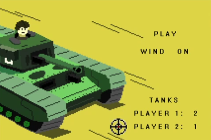
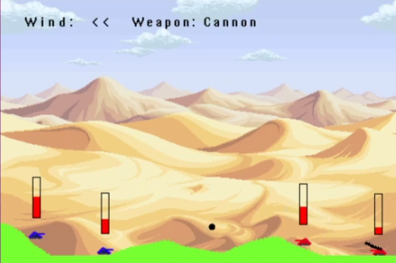
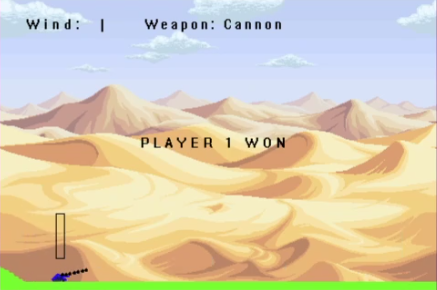

# Tank_APOcalypse_C_game

Game for 2 players programmed in C programming language with SDL2 library similar to Worms intended to run on MicroZed development board.

This game was a part of final assignment for computer architecture class 2020 at CTU in Prague.
<br/>
Code for controlling the MicroZed board will not be published.

<br/>
<p align="center">
    
    <br/>
    <br/>
    
    <br/>
    <br/>
    
  </a>
</p>

<br/>


### Gameplay video on MicroZed board
https://www.youtube.com/watch?v=Yrv8gW5AzSg

### PC controls
Some keys have multiple functions which are activated after confirming the previous action.
So for example, keys A and D are responsible for moving the tanks, but after confirming this action with key S, A and D will now be responsible for changing the power the projectile is launched with.
* Key A: Moving left, after pressing key S -> lowering the launch power
* Key D: Moving right, after pressing key S -> more power to the launch of projectile
* Key S: 1. click- confirming the movement change, 2. click- launching the projectile
* Key L: Rotating the tank barrel clockwise
* Key J: Rotating the tank counter-clockwise
* Key K: Changing weapons {cannon, sniper}


<!--
*** Thanks for checking out this README Template. If you have a suggestion that would
*** make this better, please fork the repo and create a pull request or simply open
*** an issue with the tag "enhancement".
*** Thanks again! Now go create something AMAZING! :D
-->


## Dependencies
* [C](https://en.wikipedia.org/wiki/C_(programming_language))
* [SDL2](https://www.libsdl.org/download-2.0.php)
* [SDL2 Image](https://www.libsdl.org/projects/SDL_image/)

## Usage
After successfully installing dependencies you can
move to the main directory and compile the code with included MakeFile. <br/>
```sh
make
```
After successfully compiling the code you can start the game.
```sh
./mzapo
```
<br/>
The game is controlled by typing commands and pressing enter.<br/>
So if you want to move 5 pixels to the right, then 2 pixels to the left, changing weapons and firing.

```sh
dddddaakss
```
and press enter.

### Creators
Peter Basár https://twitter.com/peterbasar
<br/>
Ivan Čermák https://github.com/NotMyName2

#### License
Open Source Apache LicenseVersion 2.0, January 2004. See LICENSE for more information.
